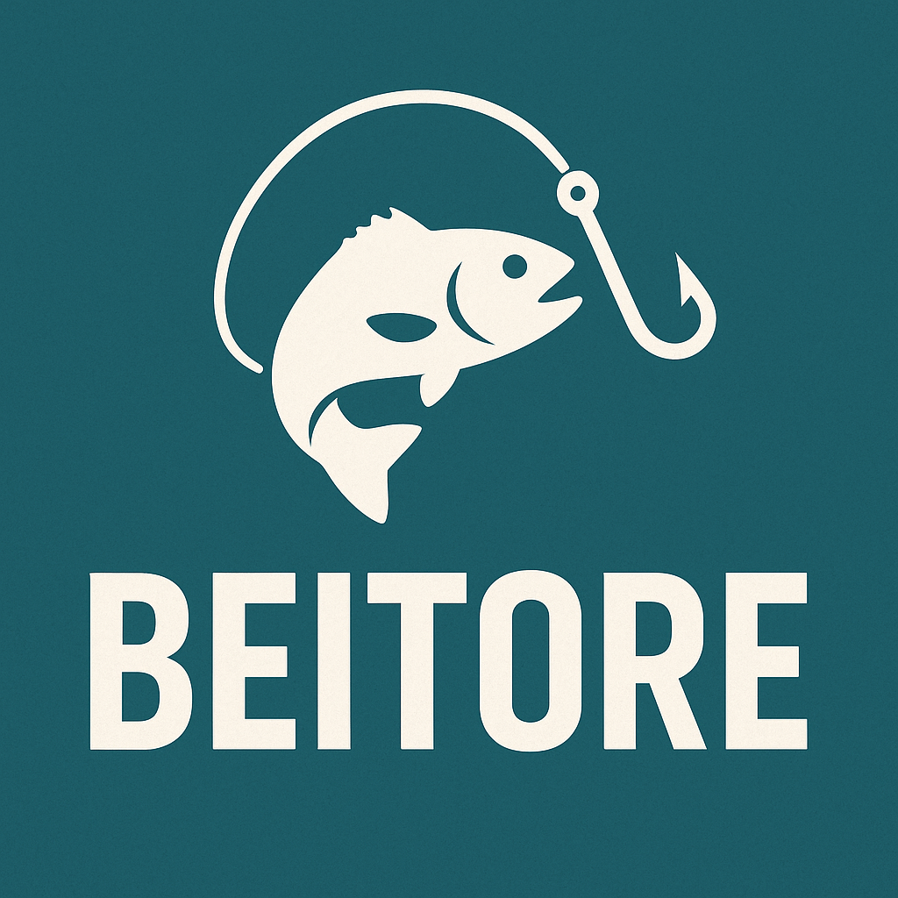

# BEITORE
サービスURL : https://baitrade.com/

### 魚の餌や釣れすぎた魚などを交換できるアプリ

## 🐟サービス概要🐟
- 釣りでの餌、魚のもったいないをなくすサービス。
- 釣り人同士が連絡を取りあい、餌の譲渡、魚の譲渡を行う。
- 釣り場の美化、SDGs

## サービスの利用イメージ
- 釣り場で餌が余ったとき、他の釣り人に譲渡することで無駄を減らせます。逆に、餌が足りないときも近くの釣り人から譲り受けられるため、追加購入の手間を省けます。
- 釣れすぎて持ち帰れない魚を、欲しい人に譲ることで食材を無駄にしません。これにより、資源の有効活用が可能になります。
- 余った餌や不要な魚の処分に困ることがなくなり、釣り場の清潔さを維持できます。また、食品ロスの削減にも貢献できるため、環境にも優しい釣りが実現します。

## このサービスへの思い・作りたい理由
趣味で釣りをする中で、思った以上に魚が釣れず餌が余ったり、逆に釣れすぎて餌が足りなくなることが多々あります。  
  本来なら釣具屋へ買いに行ったり、現地で代わりになるものを探したりする必要がありますが、近くの釣り人同士で譲渡できれば無駄を減らし、環境にも良い影響を与えられるのではと考えました。  
  そこで、釣り人同士が餌や魚を譲り合い、資源を有効活用できるサービスを作りたいと思いました。

## ユーザー層について
- 《釣り人》の若者から年長者の方まで

  
## 追加していきたい機能の実装方針予定
- ActionCable を利用して WebSocket 通信を実装し、リアルタイムチャットを提供予定。

##機能紹介
- タイトル、説明、釣り場、価格、画像の投稿
- 投稿検索機能
- 釣り場マップ検索機能
- チャット機能

新規投稿機能：あなたの余った餌、いらなくなった餌🦐、釣れすぎた魚🐟などを投稿してください

投稿検索機能：あなたの希望の釣り場などを検索機能で探してみてください🔍

釣り場マップ検索機能：マップ🗺️から探すことも可能です、また近くの釣り場を探したいときもここから調べれます

チャット機能：一対一のチャット💬が可能です、同じ方とのチャットは一つまでですのでご注意ください

## 使用技術

| カテゴリ | 技術 |
| --- | --- |
| フロントエンド | Ruby on Rails (hotwire) / javascript |
| バックエンド | Ruby 3.2,2 / Ruby on Rails 7.1.5.1 |
|データベース | PostgreSQL 17.2 |
｜ 認証 | auth0 |
| 環境構築 | docker |
| CI/CD | Github Actions |
| インフラ | fly.io / Amazon S3 |
| その他 | Tailwind CSS |

### ER図

